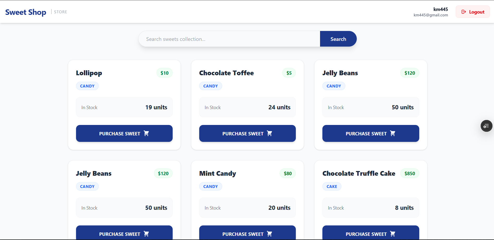
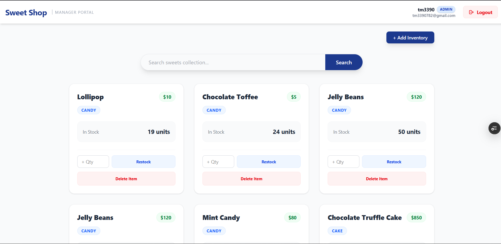
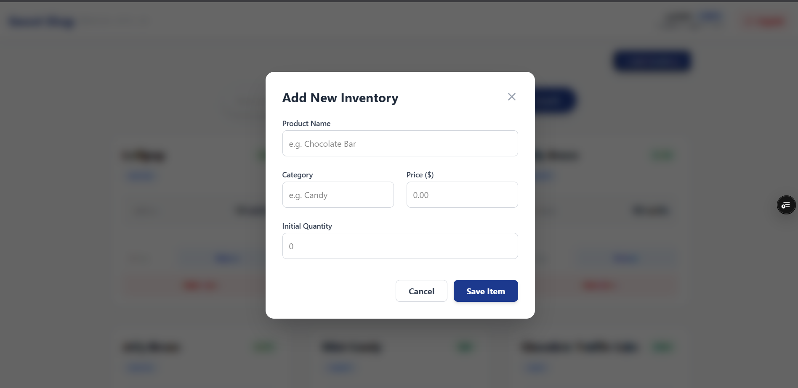
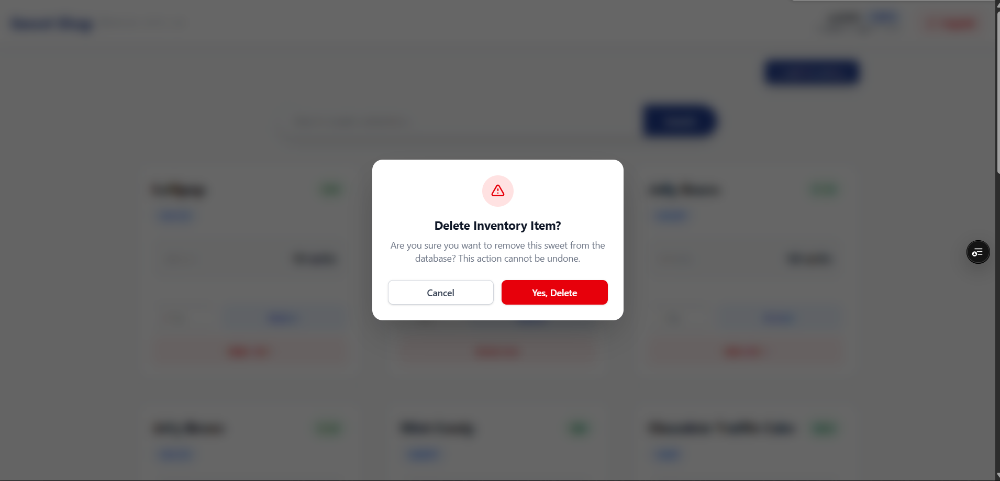
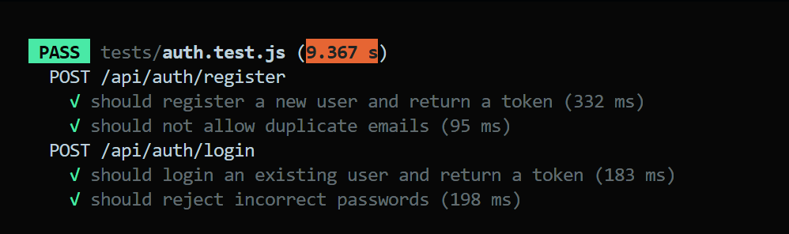
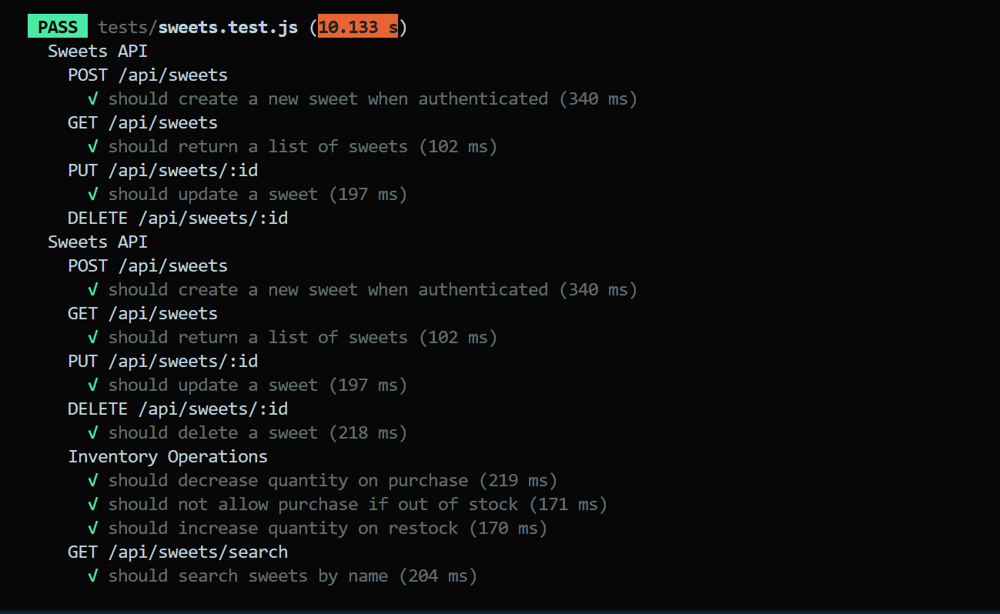

#  Sweet Shop Management System

A full-stack, responsive **Single Page Application (SPA)** for managing a sweet shop’s inventory and sales.
Built using **Test-Driven Development (TDD)** and modern web technologies.

This project focuses on **clean architecture, secure authentication, role-based access control, and full backend test coverage**.

---

## 🔗 Live Links
- **Public Repository:** https://github.com/tm33976/Sweet-Shop-Management-System
- **Live Demo:** https://sweet-shop-management-system-henna-sigma.vercel.app/

---

## 🚀 Features

### Authentication
- Secure User Registration & Login
- JWT-based authentication
- Password hashing with bcrypt
- Role-based access (User vs Admin)

### Product Dashboard
- View all available sweets
- Dynamic search by name or category
- Real-time inventory updates

### Inventory Management
- Purchase sweets (automatic stock reduction)
- Stock availability validation
- Real-time stock tracking

### Admin (Manager Portal)
- Restricted admin access
- Add new sweets via modal
- Restock existing sweets
- Delete sweets with confirmation popup

### UI & UX
- Fully responsive design
- Built with Tailwind CSS
- Toast notifications for actions
- Clean, modern SPA experience

---

## 📸 Application Screenshots

### User Dashboard


### Admin Manager Portal


### Add Inventory Modal


### Delete Confirmation


---

## 🧪 Test Execution Report

The backend is fully tested using **Jest** and **Supertest** following strict TDD principles.

- **Coverage:** 100% of Backend API Endpoints
- **Status:** All tests passed
## Report-1

## Report-2



```text
PASS  tests/auth.test.js (9.367 s)
PASS  tests/sweets.test.js (10.133 s)

Test Suites: 2 passed, 2 total
Tests:       12 passed, 12 total
Snapshots:   0 total
Time:        10.916 s
```

---

## 🛠️ Tech Stack

### Frontend
- React (Vite)
- Tailwind CSS
- Axios
- React Router DOM
- React Toastify

### Backend
- Node.js
- Express.js
- MongoDB
- Mongoose
- JWT
- bcrypt

### Testing
- Jest
- Supertest

---

## ⚙️ Installation & Setup

### Prerequisites
- Node.js v14+
- MongoDB (Local or Atlas)

### 1. Clone the Repository
```bash
git clone https://github.com/tm33976/Sweet-Shop-Management-System.git
cd Sweet-Shop-Management-System
```

### 2. Backend Setup
```bash
cd server
npm install
```

Create a `.env` file in `server`:
```env
PORT=5000
JWT_SECRET=your_super_secret_key_change_this
MONGO_URI=mongodb://localhost:27017/sweetshop_live
MONGO_URI_TEST=mongodb://localhost:27017/sweetshop_test_execution
```

Start the server:
```bash
npm start
```

### 3. Frontend Setup
```bash
cd client
npm install
```

Create a `.env` file in `client`:
```env
VITE_API_URL=http://localhost:5000/api
```

Start the app:
```bash
npm run dev
```

---

## 👑 Create an Admin User

1. Register a user in the app
2. Open MongoDB Compass
3. Connect to `sweetshop_live`
4. Open `users` collection
5. Set `isAdmin: true`
6. Refresh the app

---

## 🤖 AI Usage Disclosure

AI tools (Gemini) were used to:
- Scaffold Jest & Supertest tests
- Debug MongoDB duplicate key issues
- Generate regex logic for search
- Assist with Tailwind UI structure

AI assisted with syntax and configuration only  **not architecture or business logic**.

---

## 📝 API Endpoints

| Method | Endpoint | Description | Access |
|------|--------|------------|--------|
| POST | /api/auth/register | Register user | Public |
| POST | /api/auth/login | Login | Public |
| GET | /api/sweets | Get all sweets | Public |
| GET | /api/sweets/search | Search sweets | Public |
| POST | /api/sweets | Add new sweet | Admin |
| PUT | /api/sweets/:id | Update sweet | Admin |
| DELETE | /api/sweets/:id | Delete sweet | Admin |
| POST | /api/sweets/:id/purchase | Purchase sweet | User |
| POST | /api/sweets/:id/restock | Restock sweet | Admin |

---

## 👨‍💻 Author
**Tushar Mishra**  
📧 tm3390782@gmail.com
